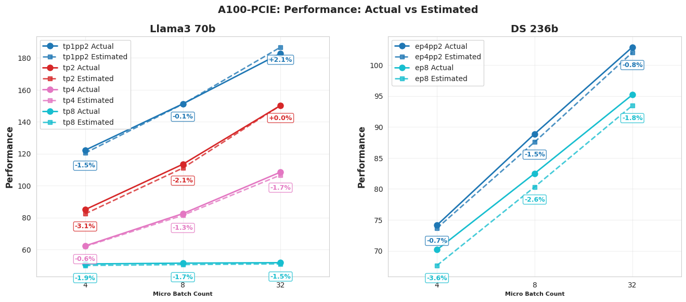

# SimuMax: a static analytical model for LLM distributed training
* [Latest News](#latest-news)
* [Introduction](#introduction)
* [Getting Started](#Installation)
* [Unitest](#Unitest)
* [TODO](#todo)
* [Acknowledgements](#acknowledgements)
* [Community](#Community)
## Latest News
- 📣 NEW! [App](./app/README.md) - Add a user application to the SimuMax.
- 📣 NEW! [Strategy Search](./examples/search/llm_search.py) - Support strategy search.
- 📣 NEW! [System Config Pipeline](./simu_tools/efficency_test/README.md) - Add a Pipeline to generate system file include computing and communication efficiency.


## Introduction
SimuMax is a distributed training simulator designed for large-scale language model (LLM) workloads. It leverages a static analytical model to simulate and analyze both performance and memory usage, providing detailed insights into training efficiency without running the actual training process. Based on these analyses, SimuMax helps users explore potential ways to maximize computational efficiency.

We have taken into account the current real-world implementations of distributed training, such as Megatron-LM and DeepSpeed, and implemented two key analytical models: **cost model** and **memory model**. By combining these with a roofline model, we simulate and estimate the training process, offering support for various distributed strategies such as tensor parallelism (TP), sequence parallelism (SP), pipeline parallelism (PP), fused kernels, ZeRO 1, recomputation, and more.

It's appropriate to address various use-cases:
1. For user who wants to find an optimal strategy to maximize the training efficiency.
2. For the framework/large model algorithm engineer, it provides optimization directions and debugging analysis.
3. For the chip manufacturer, it provides a tool that can predict performance is required as a reference to assist in the design of various specifications.


### Support features
- [x] Data Parallel
- [x] Tensor Parallel
- [x] 1F1B Pipeline Parallel
- [x] Sequence Parallel
- [x] Expert Parallel
- [x] Zero1
- [x] MoE (only balanced workload)
- [x] Full Recompute
- [x] Selective Recompute
- [x] MLA
- [x] Layer Specification for first/last-stage layer
- [x] Customizable dense layers for MoE
- [x] Megatron Compatibility: Simplified model migration pipeline
- [x] Finer-grained selective recompute
- [x] Efficiency measurement across shapes/layouts
- [x] Efficiency measurement pipeline for both computing and commucation
- [x] Strategy Search


### Benchmarks
Performance of some models on a single node. Llama3-70B was trimmed to 12 layers and DeepSeek-236B was trimmed to 4 layers.
Details can be found in  [FULL_RESULTS](docs/FULL_RESULTS.md) 


#### A100-Pcie
Please refer to [./simu_tools/megatron_scripts/README.md](./simu_tools/megatron_scripts/README.md) for the benchmark script.



# Getting Started
## Installation
### Build from source
Users can clone source code and build SimuMax from source:

1. Clone the repository.
```shell
git clone git@github.com:MooreThreads/SimuMax.git
cd SimuMax
```

2. Install the python package.
```shell
pip install -r requirements.txt
pip install -v -e .
```


## Example
We recommend using our app program to get started with SimuMax with zero cost. Please refer to the [README](./app/README.md) for more details. 

Please refer to the [tutorial](./docs/tutorial.md) for more details.

```bash
cd ./examples
python perf_llama3_8b_tp1_pp2.py
# The results are stored in the llama3_8b_a100_pcie_bf16 directory
```
The output is as follows, the output details are saved in the ./llama3_8b_a100_pcie_bf16 directory:
```
-------------SIMUMAX SUMMARY  llama3_8b(8.03B) TP=1,EP=1,PP=2 -------------
- parallelism = layer32.dense0.seq4096.mbs1.mbc8.gbs32 tp1.ep1.pp2.dp4.etp1.edp4, world_size:8
- recompute = No Recompute
- dtype = bf16, grad_reduce = fp32
- system = a100_pcie_bf16
- model_type = dense
· mfu = 0.48
· TFLOPS = 151.01T (tflops=843.3426 T, duration=5.5848 s)
· TFLOPS_PER_TOKEN = 0.01T, duration=5.5848 s
· peak_alloc_mem = {'first_stage': '50.8854 GB', 'last_stage': '45.1637 GB'}
- peak_alloc_mem_with_reserved = {'first_stage': '54.1334 GB', 'last_stage': '48.0465 GB'}
- TGS_per_gpu = 2933.6554333899194
- net = pp_net=intra_node_pcie_8x, tp_net=intra_node_pcie_2x, dp_net=intra_node_pcie_4x, ep_net=intra_node_pcie_2x, etp_net=intra_node_pcie_2x 
------------------------------------------
```

## Strategy search example
We provide a set of strategy search scripts that run on the [llm_search.py](./examples/search/llm_search.py) model, which can be used to search for the optimal strategy for your model.
```
cd examples/llm_search
python llm_search.py
```

The example strategy search output results are saved in the directory ./search_deepseek_v3_a100_pcie_bf16 and search_deepseek_v2_a100_pcie_bf16.


## Generate system file

If you want to use SimuMax on new equipment, please refer to [./simu_tools/efficency_test/README.md](./simu_tools/efficency_test/README.md) to generate system files.

## Benchmark
We provide a set of benchmark testing scripts that run on NVIDIA GPUs, which can be used for SimuMax simulation calibration. These scripts enable actual measurements for llama and deepseek models. The benchmark results will be stored in a designated directory. For detailed benchmark procedures and interpretation of results, please refer to [./simu_tools/megatron_scripts/README.md](./simu_tools/megatron_scripts/README.md).

## Notes
- Currently, all Linear models are forced to perform gradient accumulation fusion.


# TODO
SimuMax is in active development, may contain bugs or incomplete features. Contributions are welcome!
There are features to be added. Several significants are:
- Support context parallel
- More pipeline scheduler
- Overlap between computation and communication
- Offloading
- More accurate memory-bound operator simulation


# Acknowledgements
Some aspects of the design and interfaces were inspired by [Calculon](https://github.com/calculon-ai/calculon). We appreciate the work done by the authors of that repository, which provided helpful references during development.


# Community

### Issue Reporting
If you find any problems for SimuMax, please open an issue.

### Contributions
Welcome any form of contribution of code, model implementation and document!


### Join Our Team
If you're passionate about:

Large-scale models for MoE, Reinforcement Learning, Multi-Modal
GPU/GPU-Cluster Training/Inference performance optimization

Feel free to reach out to hxuerong7@gmail.com.

## Star History

[](https://www.star-history.com/#MooreThreads/SimuMax&type=date&legend=top-left)  