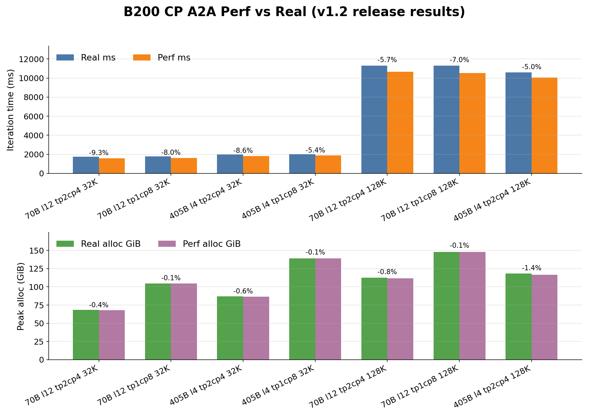

# B200 Release v1.2 Summary

- generated_at: `2026-05-01T00:00:00+00:00`
- system_rel: `configs/system/b200_bf16_ceperm.json`

## Notes

- Canonical formal result table for current B200 work.
- Includes only non-VPP perf-vs-real rows and dense CP long-seq a2a perf-vs-real rows.
- DeepSeekV2 CP real-only exploratory rows are intentionally excluded from the formal table.
- perf_alloc_gib and alloc_err_pct refreshed on 2026-04-27 after enabling row-linear dummy-wgrad tracking and removing overlap-grad-reduce gating from dummy shape tracking.
- perf_alloc_gib and alloc_err_pct refreshed on 2026-04-27 after updating CE-fusion cache/peak modeling in ParallelCE.
- CP long-seq perf_alloc_gib and alloc_err_pct refreshed on 2026-04-27 after attention saved-output cache modeling for CP A2A / FP8 alignment.
- CP long-seq perf_ms and rel_err_pct refreshed on 2026-05-01 with B200 TE2.11.0 replay; TE >= v2.8 CP A2A backward only all-to-alls dO on the O side.
- B200 JSON detail fields perf_peak_reserved_gib and peak_alloc_by_stage_gib refreshed on 2026-05-01 with the same replay config; DeepSeekV3 formal rows use dense_layers=1.

| case | section | real ms | perf ms | rel err | real alloc GiB | perf alloc GiB | alloc err | status |
|---|---|---:|---:|---:|---:|---:|---:|---|
| llama3_70b_l12_tp1_pp2_dp4_mbc4_cef | - | 843.00 | 828.76 | -1.69% | 66.55 | 66.44 | -0.17% | ok |
| llama3_70b_tp2_pp1_dp4_l12_mbc4_cef | - | 725.50 | 698.81 | -3.68% | 60.68 | 60.51 | -0.28% | ok |
| llama3_70b_l12_tp4_pp1_dp2_mbc4_cef | - | 409.80 | 395.23 | -3.56% | 39.07 | 38.94 | -0.33% | ok |
| llama3_70b_l12_tp8_pp1_dp1_mbc4_cef | - | 280.90 | 255.71 | -8.97% | 28.29 | 28.17 | -0.42% | ok |
| deepseekv2_tp1_ep8_pp1_dp8_l4_mbc4_cef | - | 366.60 | 343.59 | -6.28% | 45.63 | 45.40 | -0.50% | ok |
| deepseekv2_tp1_ep4_pp2_dp4_l4_mbc4_cef | - | 282.10 | 251.91 | -10.70% | 44.70 | 44.37 | -0.74% | ok |
| deepseekv3_l4_tp1_ep8_pp1_dp8_mbc4_cef | - | 603.20 | 584.91 | -3.03% | 104.30 | 103.52 | -0.75% | ok |
| deepseekv3_l4_tp1_ep4_pp2_dp4_mbc4_cef | - | 452.20 | 452.45 | +0.06% | 114.00 | 113.08 | -0.81% | ok |
| llama3_70b_l12_tp1_pp2_dp4_mbc8_cef | - | 1476.80 | 1441.20 | -2.41% | 66.55 | 66.44 | -0.17% | ok |
| llama3_70b_tp2_pp1_dp4_l12_mbc8_cef | - | 1387.00 | 1309.80 | -5.57% | 60.68 | 60.51 | -0.28% | ok |
| llama3_70b_l12_tp4_pp1_dp2_mbc8_cef | - | 765.60 | 747.66 | -2.34% | 39.07 | 38.94 | -0.33% | ok |
| llama3_70b_l12_tp8_pp1_dp1_mbc8_cef | - | 556.70 | 493.39 | -11.37% | 28.29 | 28.17 | -0.42% | ok |
| deepseekv2_tp1_ep8_pp1_dp8_l4_mbc8_cef | - | 676.20 | 630.64 | -6.74% | 45.63 | 45.40 | -0.50% | ok |
| deepseekv2_tp1_ep4_pp2_dp4_l4_mbc8_cef | - | 492.60 | 435.14 | -11.66% | 44.70 | 44.37 | -0.74% | ok |
| deepseekv3_l4_tp1_ep8_pp1_dp8_mbc8_cef | - | 1101.70 | 1054.50 | -4.28% | 104.30 | 103.52 | -0.75% | ok |
| deepseekv3_l4_tp1_ep4_pp2_dp4_mbc8_cef | - | 771.60 | 761.96 | -1.25% | 114.00 | 113.08 | -0.81% | ok |
| llama3_70b_l12_tp1_pp2_dp4_mbc32_cef | - | 5436.50 | 5115.70 | -5.90% | 66.55 | 66.44 | -0.17% | ok |
| llama3_70b_tp2_pp1_dp4_l12_mbc32_cef | - | 5376.50 | 4975.90 | -7.45% | 60.68 | 60.51 | -0.28% | ok |
| llama3_70b_l12_tp4_pp1_dp2_mbc32_cef | - | 2964.60 | 2862.20 | -3.45% | 39.07 | 38.94 | -0.33% | ok |
| llama3_70b_l12_tp8_pp1_dp1_mbc32_cef | - | 2073.70 | 1919.40 | -7.44% | 28.29 | 28.17 | -0.42% | ok |
| deepseekv2_tp1_ep8_pp1_dp8_l4_mbc32_cef | - | 2721.30 | 2352.90 | -13.54% | 45.63 | 45.40 | -0.50% | ok |
| deepseekv2_tp1_ep4_pp2_dp4_l4_mbc32_cef | - | 1727.70 | 1534.50 | -11.18% | 44.70 | 44.37 | -0.74% | ok |
| deepseekv3_l4_tp1_ep8_pp1_dp8_mbc32_cef | - | 4141.20 | 3872.20 | -6.50% | 104.30 | 103.52 | -0.75% | ok |
| deepseekv3_l4_tp1_ep4_pp2_dp4_mbc32_cef | - | 2718.60 | 2619.00 | -3.66% | 114.00 | 113.08 | -0.81% | ok |
| llama3_405b_l4_tp1_pp2_dp4_mbc4_cef | - | 1074.60 | 1072.70 | -0.18% | 87.08 | 86.88 | -0.23% | ok |
| llama3_405b_l4_tp2_pp1_dp4_mbc4_cef | - | 907.30 | 860.73 | -5.13% | 81.59 | 81.31 | -0.34% | ok |
| llama3_405b_l4_tp4_pp1_dp2_mbc4_cef | - | 476.00 | 452.92 | -4.85% | 52.89 | 52.68 | -0.40% | ok |
| llama3_405b_l4_tp8_pp1_dp1_mbc4_cef | - | 258.80 | 255.83 | -1.15% | 38.57 | 38.38 | -0.49% | ok |
| llama3_405b_l4_tp1_pp2_dp4_mbc8_cef | - | 1935.40 | 1870.80 | -3.34% | 87.08 | 86.88 | -0.23% | ok |
| llama3_405b_l4_tp2_pp1_dp4_mbc8_cef | - | 1716.80 | 1600.40 | -6.78% | 81.59 | 81.31 | -0.34% | ok |
| llama3_405b_l4_tp4_pp1_dp2_mbc8_cef | - | 899.60 | 846.87 | -5.86% | 52.89 | 52.68 | -0.40% | ok |
| llama3_405b_l4_tp8_pp1_dp1_mbc8_cef | - | 488.10 | 486.81 | -0.26% | 38.57 | 38.38 | -0.49% | ok |
| llama3_405b_l4_tp1_pp2_dp4_mbc32_cef | - | 7046.40 | 6659.30 | -5.49% | 87.08 | 86.88 | -0.23% | ok |
| llama3_405b_l4_tp2_pp1_dp4_mbc32_cef | - | 6604.10 | 6038.70 | -8.56% | 81.59 | 81.31 | -0.34% | ok |
| llama3_405b_l4_tp4_pp1_dp2_mbc32_cef | - | 3455.40 | 3210.60 | -7.08% | 52.89 | 52.68 | -0.40% | ok |
| llama3_405b_l4_tp8_pp1_dp1_mbc32_cef | - | 1901.80 | 1872.60 | -1.54% | 38.57 | 38.38 | -0.49% | ok |
| llama3_70b_l12_tp2_cp4_pp1_dp1_seq32768_mbc4_cef | - | 1758.00 | 1595.00 | -9.27% | 68.43 | 68.16 | -0.39% | ok |
| llama3_70b_l12_tp1_cp8_pp1_dp1_seq32768_mbc4_cef | - | 1768.10 | 1627.20 | -7.97% | 104.51 | 104.43 | -0.08% | ok |
| llama3_405b_l4_tp2_cp4_pp1_dp1_seq32768_mbc4_cef | - | 1984.70 | 1814.30 | -8.59% | 87.03 | 86.55 | -0.55% | ok |
| llama3_405b_l4_tp1_cp8_pp1_dp1_seq32768_mbc4_cef | - | 2003.60 | 1896.20 | -5.36% | 139.22 | 139.13 | -0.06% | ok |
| llama3_70b_l12_tp2_cp4_pp1_dp1_seq131072_mbc4_cef | - | 11315.70 | 10670.40 | -5.70% | 112.67 | 111.80 | -0.77% | ok |
| llama3_70b_l12_tp1_cp8_pp1_dp1_seq131072_mbc4_cef | - | 11301.90 | 10515.70 | -6.96% | 147.99 | 147.89 | -0.07% | ok |
| llama3_405b_l4_tp2_cp4_pp1_dp1_seq131072_mbc4_cef | - | 10577.60 | 10043.50 | -5.05% | 118.13 | 116.50 | -1.38% | ok |
